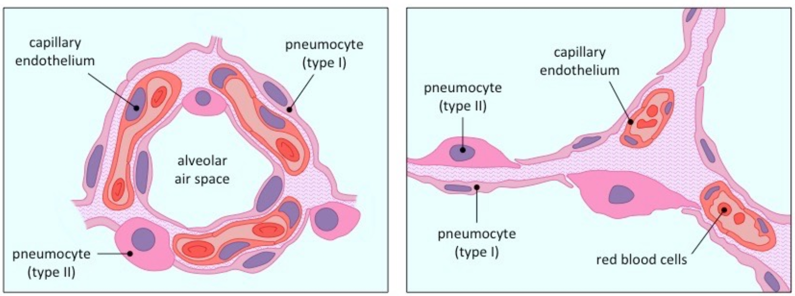
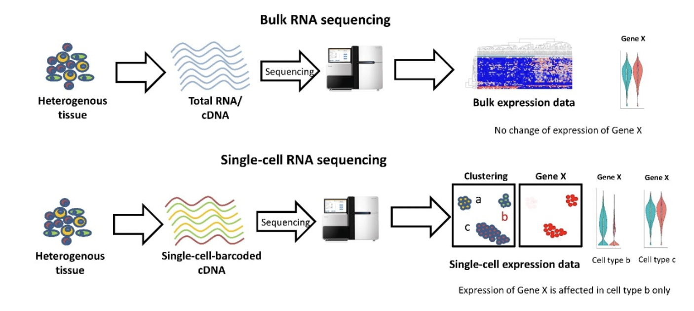
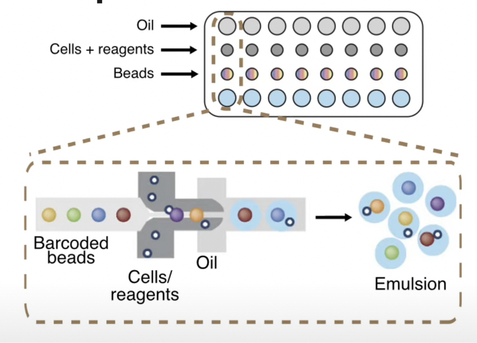
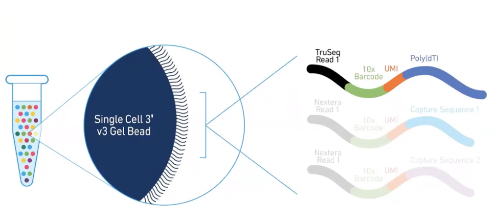
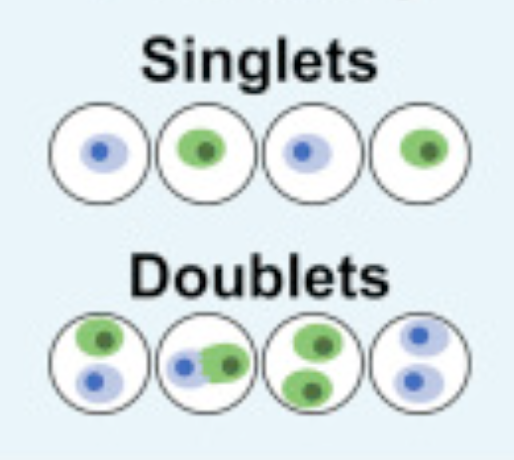
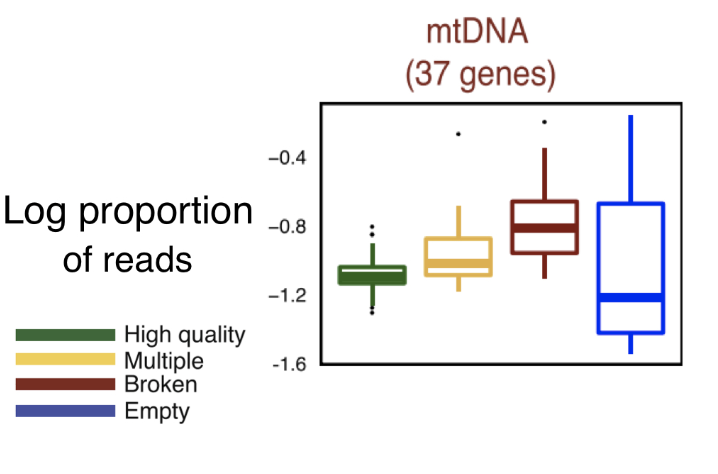
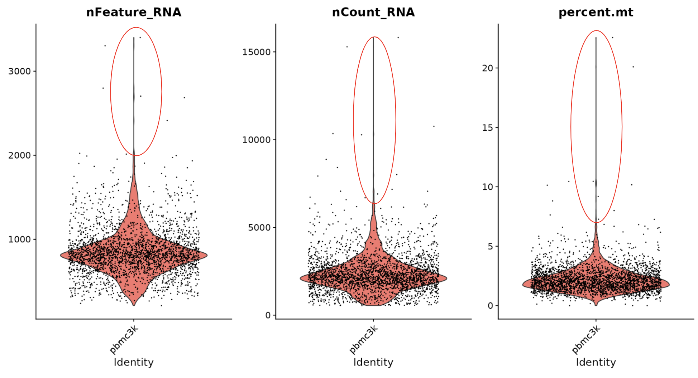
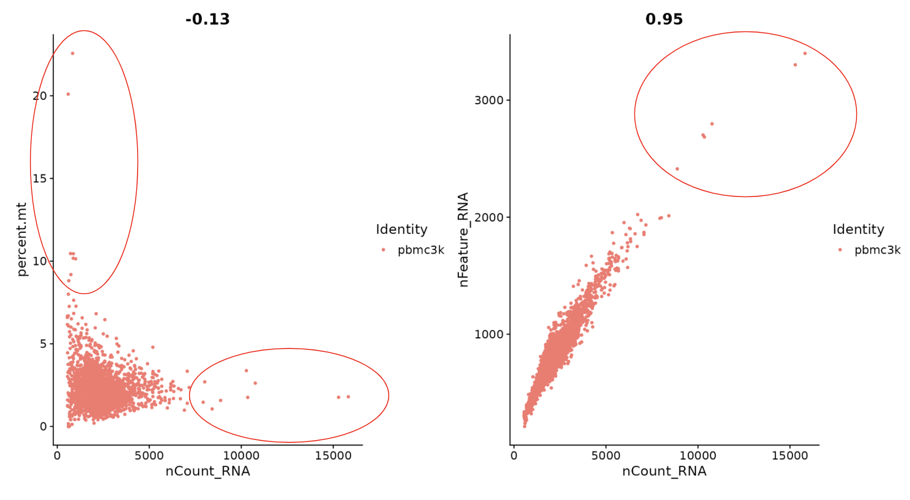

# **scRNA-seq**
##### by Group 11: Yuxuan Du, Yiming, Gao, Tianya Zhan
## **Purpose**
Imagine we are interested in genes that cause lung cancer. We collect cells from our lung tissue, but there are different cells in this tissue. If we treat all kinds of cells as the same type, which is exactly what we do in bulk RNA-seq, since gene expressions are different in different cells, it is obvious that we will lose important information. How do we know which gene in which kinds of cells is the key abnormality that causes cancer?

###### Figure1: Lung tissue
To deal with these problems, techniques that can separately analyze different cells in the same tissue are needed. scRNA-seq is the one that tackles this problem. scRNA-seq can sequence different cells, and generate a dataset in which each sample is a cell in the tissue and the features are the gene expression of the cell. And most importantly, this technique allows us to analyze more than 15000 cells in a short period of time, which significantly save researchers time. 

###### Figure2: Difference Between Bulk RNA-seq and scRNA-seq
Due to the efficiency and effectiveness of the technique, it is useful to learn more about scRNA-seq technology.

## **Upstream** 
### **Sequencing Process**
Here we can see the process of sequencing: 
Encoded beads will flow through the microfluidics and meet with the cell. The microfluidics are well designed so that only one beads are allowed to pass. The combination of a cell, a bead, and reagents will form a droplet when they enter the microfluidic that is filled with oil. Then the connection of barcode and RNA will starts. After RNA gets barcoded, we will use PCR to amplify reads and sequence all reads using RNA-seq techniques.

###### Figure 3: 10X seq
### **The Beads and Barcodes**
We can notice there are few region on our barcode. These barcodes are critical for researchers to know the origin of different RNA reads, and there are different function for different region. The 10x barcodes region will indicate the origin of the read, and the UMI code region can reduce the bias from amplification steps by indicating reads that are multiple copies of the same gene or actually different genes. After that, we will start our downstream analysis. 

###### Figure4: Bead and Barcode

## **Downstream**
The key downstream analysis in single-cell sequencing involves an *R toolkit* called **Seurat** which is named after *Georges Seurat*, a famous French artist. You can also check this [Tutorial](https://satijalab.org/seurat/articles/pbmc3k_tutorial.html) from Seurat for a detailed step by step walkthrough of the pipeline. 

The **standard pipeline** of Seurat includes:
1. Quality Check
2. Normalize Data
3. Find Vairable Genes
4. Perform Linear Dimention Reduction
5. Generate Clusters
6. Perform Differential Analysis
7. Visualize the Results

### **Quality Check**
After reading in the feature-barcode matrix from the 10X [*Cell Ranger*](https://support.10xgenomics.com/single-cell-gene-expression/software/pipelines/latest/what-is-cell-ranger) pipeline ( which aligns the reads to the reference transcriptome and generates feature-barcode matrix that is used in Seurat ), we need first to perform the quality check step to identify and eliminate some outliers and poor-quality data before any further analysis. There are three commonly used measures to consider during quality check: 
- The total number of genes expressed in a cell
    - A cell with very few unique gene expressed often indicates a low quality cell or an empty droplet.
- The number of unique genes expressed in a cell ( which strongly correlates with the total number of genes expressed in a cell )
    - A cell with very high gene count may indicates a cell doublet or multiplet which means that two or more cells are sequenced as a single cell. 
    
    ###### Figure5: Singlets Vs. Doublets
- The *percent* of reads coming from mitochondrial genes
    - Every cell has copies of mitochondria genes, because mitochondria has its own genome. A **dead or dying cell** will enrich the expression of mitochondria genes, so a high mitochondrial gene percentage indicates a potentially low quality cell.
    
    ###### Figure6: Box plot showing the correlation between propoortion of mitochondria reads and quality of single cell data

Violin plot and scatter plot can be used to visualize the possible outliers. 

###### Figure7: Example of violin plot to visualize outliers. Red Circle indicates possible outliers

###### Figure8: Example of scatter plot to visualize outliers. Red Circle indicates possible outliers
The circled area indicates the possible outliers. For example, based on the above figures (figure 7 and figure 8), we want to consider removing cells with the number of unique genes more than 2500 and cells with percent of mitochondrial gene counts more than 5. 

### **Seurat**

## **References**
1. “Brent Cornell.” BioNinja, http://www.ib.bioninja.com.au/options/option-d-human-physiology/d6-transport-of-respiratory/lung-tissue.html. 
2. “Recent Advances in Single-Cell Genomics Techniques.” Genomics Research from Technology Networks, https://www.technologynetworks.com/genomics/articles/recent-advances-in-single-cell-genomics-techniques-324695. 
3. IBioEducation, director. Single Cell Sequencing. YouTube, YouTube, 28 Aug. 2020, https://www.youtube.com/watch?v=k9VFNLLQP8c&amp;t=479s. Accessed 4 Dec. 2022. 
4. “01 Single Cell Introduction.” YouTube, YouTube, 20 Apr. 2020, https://www.youtube.com/watch?v=hWWkpe4Ewgo. 
6. “Seurat - Guided Clustering Tutorial.” • *Seurat*, https://satijalab.org/seurat/articles/pbmc3k_tutorial.html. 
7. L.Wolock, Samuel, et al. “Scrublet: Computational Identification of Cell Doublets in Single-Cell Transcriptomic Data.” *Cell Systems*, Cell Press, 3 Apr. 2019, https://www.sciencedirect.com/science/article/pii/S2405471218304745.
8. Ilicic, Tomislav, et al. “Classification of Low Quality Cells from Single-Cell RNA-Seq Data.” *Genome Biology*, U.S. National Library of Medicine, 17 Feb. 2016, https://www.ncbi.nlm.nih.gov/pmc/articles/PMC4758103/.  
9. “Cell Ranger.” *What Is Cell Ranger? -Software -Single Cell Gene Expression -Official 10x Genomics Support*, https://support.10xgenomics.com/single-cell-gene-expression/software/pipelines/latest/what-is-cell-ranger. 